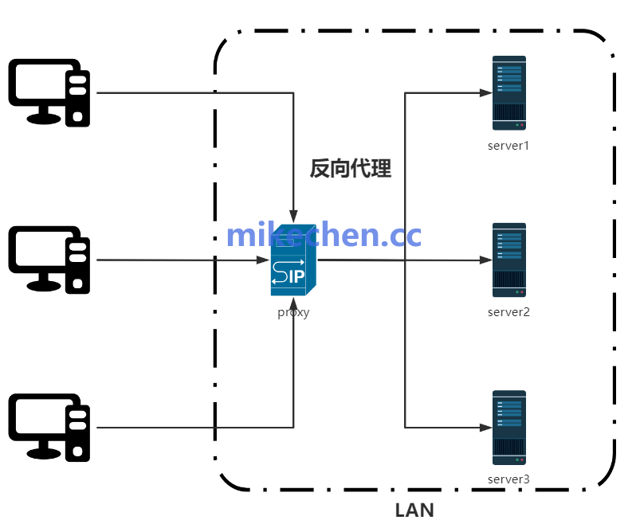
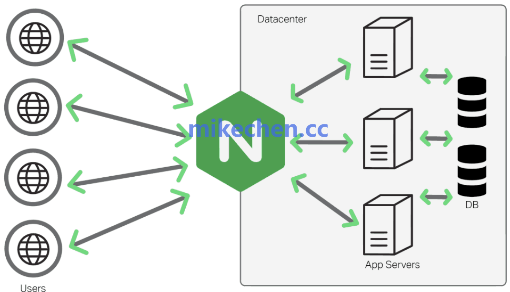
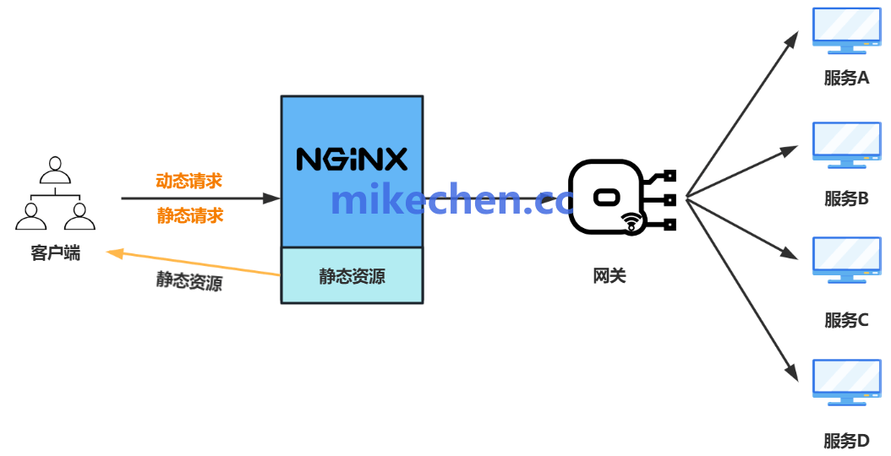

## Nginx反向代理原理
- 在互联网架构中，用户通常不会直接访问后端服务器，而是先经过一个统一入口。
- **这个入口就是：Nginx反向代理服务器。**
- 反向代理是指：**客户端并不直接访问后端真实服务器，而是先访问代理服务器。再由代理服务器转发请求到后端服务，并将结果返回给客户端。**


### 反向代理原理
- Nginx 反向代理的核心逻辑可以概括为**“接收请求—转发请求—获取响应—返回响应”**。

- 1、接受请求
  - 客户端发送:
  ```
  GET /api/user  
  
  Host:www.xxx.com
  ```
  - Nginx监听
  ```markdown
    80端口
    
    443端口
    ```
- 2、Location匹配
  - 配置
  ```markdown
    server {
    listen80;

    location /api
    {
  
    }
  
    }
    ```
  - 请求：
  ```markdown
    /api/user
    ```
  - 匹配：
  ```markdown
    location/api
    ```
- 3、upstream选择服务器
  - 配置：
  ```markdown
    upstream backend {
    server192.168.1.10:8080;
    server192.168.1.11:8080;
    }    
    ```
  ```markdown
    请求1→ server1
    请求2→ server2
    请求3→ server1
    ```
- 4. 转发请求
  - 配置：
  ```markdown
    location/{
    proxy_pass http://backend;
    }
    ```
  - 最终：
  ```markdown
    客户端
    ↓
    Nginx
    ↓
    SpringBoot
    ```
## Nginx反向代理配置
- Nginx通过proxy_pass指令实现反向代理，upstream模块定义后端服务器组。

- 请求到达Nginx后，经过location匹配，交给proxy模块处理。
```markdown
http {
     upstream backend {
         server 192.168.1.101:8080 weight=5;
         server 192.168.1.102:8080 weight=3;
         server backup.example.com:8080 backup;# 备用
}
      server {
         listen 80;
         server_name example.com;
          location /{
             proxy_pass http://backend;
             proxy_set_header Host $host;
            proxy_set_header X-Real-IP $remote_addr;
             proxy_set_header X-Forwarded-For $proxy_add_x_forwarded_for;
}
}
}
```
  - 